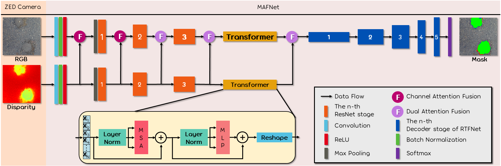
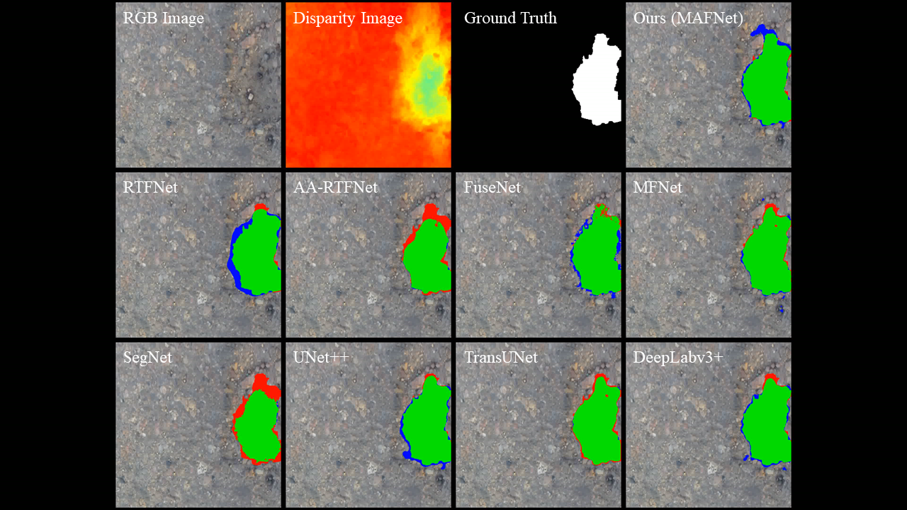
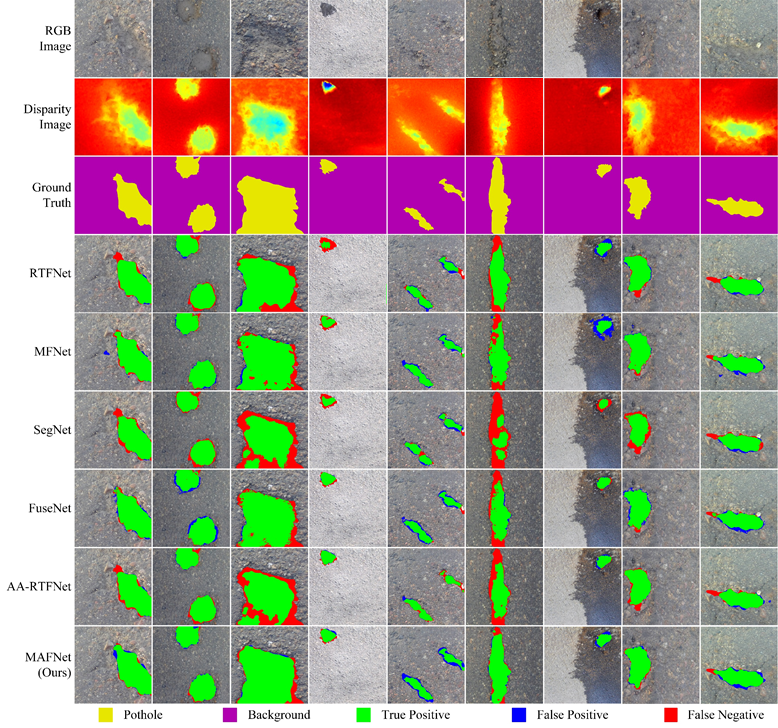

# MAFNet-PyTorch
The official pytorch implementation of **MAFNet: Segmentation of Road Potholes with Multi-modal Attention Fusion Network for Autonomous Vehicles** ([TIM](https://yuxiangsun.github.io/pub/TIM2022_mafnet.pdf)). 

We test our code in Python 3.7, CUDA 11.1, cuDNN 8, and PyTorch 1.7.1. We provide `Dockerfile` to build the docker image we used. You can modify the `Dockerfile` as you want.  



<center>
<a href="https://www.youtube.com/watch?v=hQM5IW5N91M">
</center>

# Introduction
MAFNet is a multi-modal fusion network for semantic segmentation of road potholes.
# Dataset
The original dataset can be downloaded from the AARTFnet project [page](https://sites.google.com/view/pothole-600). You can use the augmentation method proposed in this paper to get the training dataset or you can download our processed data from [here](https://labsun-me.polyu.edu.hk/zfeng/MAFNet/).
# Pretrained weights
The pretrained weight of MAFNet can be downloaded from [here](https://labsun-me.polyu.edu.hk/zfeng/MAFNet/).
# Usage
* Clone this repo
```
$ git clone https://github.com/lab-sun/MAFNet.git
```
* Build docker image
```
$ cd ~/MAFNet
$ docker build -t docker_image_mafnet .
```
* Download the dataset
```
$ (You should be in the MAFNet folder)
$ mkdir ./dataset
$ cd ./dataset
$ (download our preprocessed dataset.zip in this folder)
$ unzip -d .. dataset.zip
```
* To reproduce our results, you need to download our pretrained weights.
```
$ (You should be in the MAFNet folder)
$ mkdir ./weights_backup/MAFNet
$ cd ./weights_backup/MAFNet
$ (download our preprocessed dataset.zip in this folder)
$ unzip -d .. dataset.zip
$ docker run -it --shm-size 8G -p 1234:6006 --name docker_container_mafnet --gpus all -v ~/MAFNet:/workspace docker_image_mafnet
$ (currently, you should be in the docker)
$ cd /workspace
$ python3 run_demo.py
```
The results will be saved in the `./runs` folder.
* To train MAFNet
```
$ (You should be in the MAFNet folder)
$ docker run -it --shm-size 8G -p 1234:6006 --name docker_container_mafnet --gpus all -v ~/MAFNet:/workspace docker_image_mafnet
$ (currently, you should be in the docker)
$ cd /workspace
$ python3 train.py
```
* To see the training process
```
$ (fire up another terminal)
$ docker exec -it docker_container_mafnet /bin/bash
$ cd /workspace
$ tensorboard --bind_all --logdir=./runs/tensorboard_log/
$ (fire up your favorite browser with http://localhost:1234, you will see the tensorboard)
```
The results will be saved in the `./runs` folder.
Note: Please change the smoothing factor in the Tensorboard webpage to `0.999`, otherwise, you may not find the patterns from the noisy plots. If you have the error `docker: Error response from daemon: could not select device driver`, please first install [NVIDIA Container Toolkit](https://docs.nvidia.com/datacenter/cloud-native/container-toolkit/install-guide.html) on your computer!

# Citation
If you use MAFNet in your academic work, please cite:
```
@ARTICLE{feng2022mafnet,
  author={Zhen Feng and Yanning Guo and Qing Liang and M. Usman Maqbool Bhutta and Hengli Wang and Ming Liu and Yuxiang Sun},
  journal={IEEE Transactions on Instrumentation and Measurement}, 
  title={MAFNet: Segmentation of Road Potholes With Multimodal Attention Fusion Network for Autonomous Vehicles}, 
  year={2022},
  volume={71},
  number={},
  pages={1-12},
  doi={10.1109/TIM.2022.3200100}}
```

# Demo


# Acknowledgement
Some of the codes are borrowed from [RTFNet](https://github.com/yuxiangsun/RTFNet), [AARTFNet](https://github.com/hlwang1124/AAFramework) and [TransUNet](https://github.com/Beckschen/TransUNet)

Contact: yx.sun@polyu.edu.hk

Website: https://yuxiangsun.github.io/
